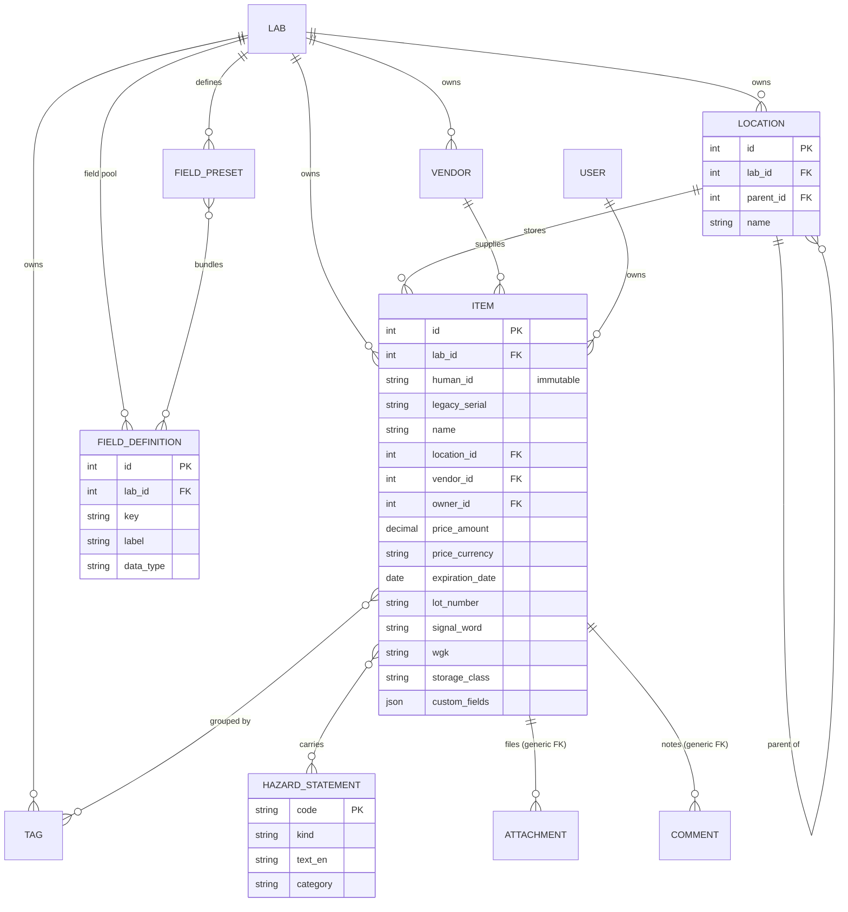
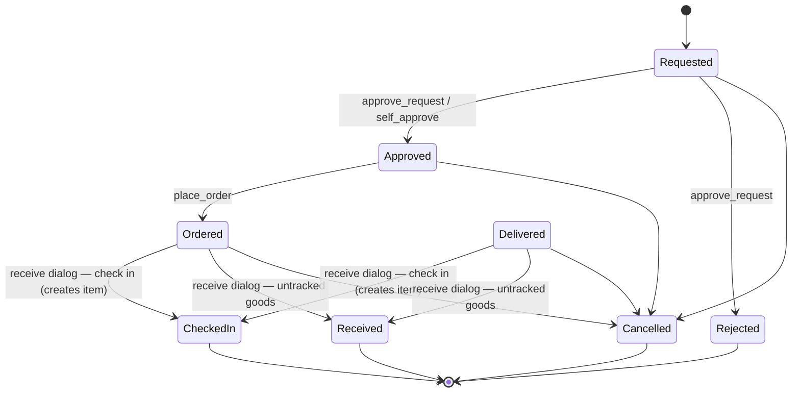
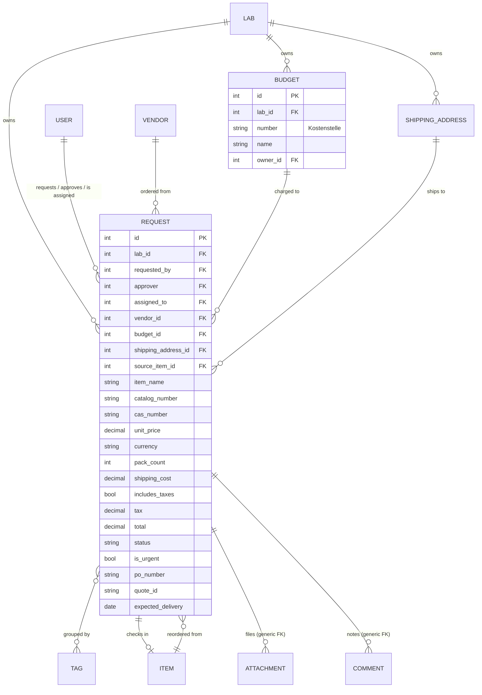
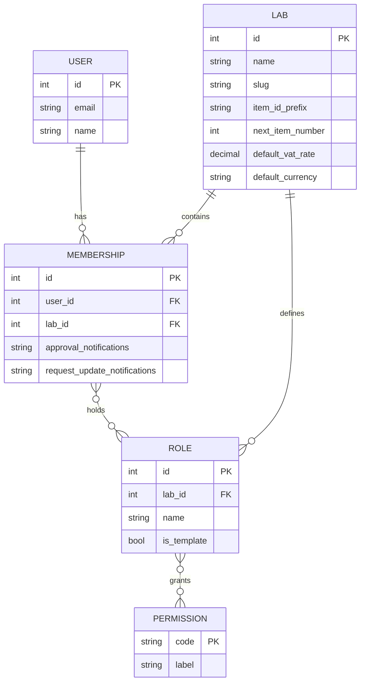

# LabButler — Build Spec & Project Context

*A free, self-hosted, Docker-deployable alternative to LabSuit for lab inventory and order
procurement.*

This document is the **architecture and design-rationale layer** of the project: what
LabButler is, the design rules that must keep holding, how the pieces fit together, and
what is planned next. The how-to layer lives in the MkDocs site under [`docs/`](docs/)
(user guide, installation & operation, developer guide); day-to-day engineering
conventions live in [CLAUDE.md](CLAUDE.md); the open work list lives in [TODO.md](TODO.md).

**Status:** the MVP described by the original spec has shipped and the project is at
**v1.0.0rc4** with substantial post-MVP work on top (role-aware dashboard, lab admin UI,
attachments & comments, forwarding workflow, LabSuit *orders* import, notification
preferences, production hardening and a Coolify deployment path). Sections below describe
the system **as implemented**, with the roadmap at the end.

---

## 1. Purpose & scope

A self-hosted web application that lets a research lab manage (a) its **inventory** of
physical items and (b) its **procurement workflow** (request → approval → order → delivery
→ check-in), with a shared, searchable record so the group avoids duplicate orders and can
track spending per cost centre.

It targets a single institute/lab that wants to leave LabSuit, keep its data, and run
everything locally without per-seat fees or a vendor shop.

## 2. Goals / non-goals

**Goals**

- Replace LabSuit's two core modules (inventory + requests) with a cleaner data model.
- Migrate existing LabSuit data via spreadsheet import without relabelling physical
  containers.
- Multi-lab capable from the start, but collapsible to a single lab at zero cost.
- Granular, lab-defined permissions.
- Immutable audit trail of all transactions.
- **Responsive UI that works on both mobile devices and desktop monitors** — phones and
  tablets at the bench (check-in/out, quick lookups, scanning) and full-width monitors for
  management, import, and reporting. Mobile-first layout, touch-friendly targets, no
  horizontal scrolling on small screens; tables collapse gracefully to card/stacked views.

**Non-goals (now, possibly ever)**

- No vendor shop / catalog / PunchOut integration.
- No accounting-grade billing. Totals are rough estimates for eyeballing against the
  university's real invoices; the university does the actual billing.
- No SSO yet (local accounts only; SSO/LDAP is on the roadmap).

## 3. Tech stack & deployment

- **Django 5** + **PostgreSQL 17** (JSONB is required for flexible custom fields; SQLite
  is not sufficient). Python packaging via **uv**.
- Server-rendered UI (Django templates + **HTMX**), styled with **Tailwind CSS**,
  responsive/mobile-first.
- **Celery + Redis** for scheduled and async work (expiry digests, outbound email, large
  imports). Email via SMTP.
- **Docker Compose** services: `web` (migrate-on-start + Gunicorn, `/healthz` probe),
  `db` (Postgres, `pgdata` volume), `worker` (Celery), `beat` (Celery beat), `broker`
  (Redis), plus a **media volume** for attachments (SDS/MSDS PDFs, quotes). Static assets
  are built into the image and served by WhiteNoise.
- **Proxy-ready / Coolify-ready:** the `web` service `expose`s its port (no host binding)
  so a fronting reverse proxy (e.g. Coolify's Traefik) terminates TLS; the app trusts
  `X-Forwarded-Proto`/`-For` and enforces HTTPS redirect, HSTS and secure cookies in
  production. See the README for the Coolify recipe.
- **Security hardening:** login brute-force lockout via django-axes (per IP + username,
  `AXES_FAILURE_LIMIT`/`AXES_COOLOFF_HOURS`, `AXES_IPWARE_PROXY_COUNT` for proxies),
  Content-Security-Policy, and env-driven `DJANGO_SECURE_*` settings.
- **Configuration is entirely env-driven** (`labbutler/settings.py`); notable variables:
  `LABBUTLER_BASE_URL` (absolute links in emails), `EXPIRY_DIGEST_DAYS` (default 30) and
  the digest-hour settings, `LABBUTLER_IMPERSONATION_ENABLED` (default: only in DEBUG),
  `PASSWORD_RESET_TIMEOUT_DAYS`, the `EMAIL_*` set, and `LABBUTLER_COMMIT` (build commit
  baked into Docker images).
- **Version footer:** every page footer shows the app version (from `pyproject.toml`) and
  build commit, resolved by `labbutler/version.py`, each linking to GitHub. Never
  hardcode a version elsewhere (see CLAUDE.md for the release procedure).

## 4. Tenancy model

- `Lab` is the top-level container and the scoping anchor: nearly every record carries a
  `lab_id`, and every query is lab-scoped (helpers in `apps/tenancy/scoping.py`).
- A **single-lab deployment is just one `Lab` row** — no special-casing, nothing lost if
  multi-lab is never used.
- A user can belong to multiple labs; the UI operates on one **active lab** at a time (a
  session concept, with a lab-switcher in the nav). Switching labs re-scopes everything
  and swaps in that lab's permissions.
- Each lab carries its own defaults: **item ID prefix**, **next item number**, **default
  VAT rate**, **default currency**, plus its managed lists (budgets, shipping addresses,
  suppliers, custom fields, locations, roles).
- An **Institute** tier above `Lab` is deferred (roadmap). Explicit cross-lab sharing
  (roadmap) does not require it.

## 5. Identity & naming

The hard rule, learned from LabSuit's `ch-2321`-changes-on-reclassification bug:

> **An identifier is never recomputed from any field that can change.**

Three separate concepts, kept separate:

- **Identity** — an internal surrogate key (auto-increment). Never shown, never changes.
- **Human identifier** — assigned **once at creation and frozen forever**,
  type-independent. New items get `{LAB_PREFIX}-{running number}`, e.g. `AGB-04821`. This
  is what goes on the container and barcode. It stays short, memorable, and searchable.
- **Barcode / Data Matrix** — the human identifier is also carried on the physical label
  as a **Data Matrix (ECC 200)** encoding *only* the human ID (e.g. `AGB-0001`). Data
  Matrix is chosen over QR / 1-D because it stays readable at ~1 cm on small, round,
  curved chemical containers. Labels are **preprinted externally** on off-the-shelf sheets
  (e.g. HERMA 189-up) — LabButler does **not** run a print service — laid out as Data
  Matrix on the left, the human-readable ID (large) on the right.

Type/classification is *not* part of the identifier. The UI may show a cosmetic
tag-derived hint next to the number, but it follows the current tags and never alters the
stored ID.

**Assigning IDs at check-in** (implemented in `apps/inventory/ids.py`). Because labels are
preprinted and handed out, the ID is *chosen*, not silently auto-incremented: when an item
is created / checked in the user picks the ID that's physically on the container rather
than always taking the next number. The UI suggests the next free IDs after the highest
one used (preprinted labels can be skipped or lost, so gaps are fine) and also accepts a
manually-typed `{PREFIX}-NNNN`, validated for uniqueness within the lab before saving.
Once chosen the ID is frozen forever (the hard rule above).

**Migration:** imported items **keep their original LabSuit serial** (`ch-0005`) as their
frozen human identifier — searchable, never recomputed — so no physical container is
relabelled. Only *new* items use the `{LAB_PREFIX}-…` scheme. Legacy serials collide
across former types (e.g. `co-0001` in two sheets); that's fine because the surrogate key
carries identity and the serial is just a searchable label.

## 6. Roles & permissions

- **Permissions** are a fixed, installation-wide catalog of capabilities (single source of
  truth: `apps/tenancy/catalog.py`, seeded by a data migration).
- **Roles** are defined *per lab* (each lab invents its own — "PhD student", "TA",
  "Postdoc") and are composed by checking/unchecking permissions.
- A user's **effective rights in the active lab = the union** of the permissions across
  the roles on that lab membership. Users can see their effective permissions on the
  account settings page.
- **Template roles** ship as starter sets and are cloned into editable, lab-owned roles at
  lab creation. No installation-wide role ever governs behaviour. The shipped templates:
  **Lab manager** (everything), **Member** (view + manage inventory, create & self-approve
  requests, check in/out), **Viewer** (read-only), **Purchase coordinator** (view
  requests, place orders, accept forwards).
- Enforcement goes through a single helper, `user.can(lab, "approve_request")`, which
  resolves membership → roles → permissions for the active lab. Views fail closed.
- **Impersonation ("View as"):** superusers can temporarily view the app as another user
  to test roles — audited on start/stop, banner always visible, and gated by
  `LABBUTLER_IMPERSONATION_ENABLED` (off in production by default).

**Permission catalog (implemented)**

| Permission | Purpose |
|---|---|
| `view_inventory` | See inventory |
| `view_requests` | See requests |
| `manage_inventory` | Create/edit/delete items, fields, presets, locations, tags |
| `import_inventory` | Run spreadsheet imports |
| `create_request` | Raise a request |
| `approve_request` | Approve a request |
| `self_approve` | Approve your own requests (with confirmation + visible comment) |
| `place_order` | Mark an approved request as ordered |
| `accept_forwards` | Receive forwarded requests (appear in the forward-to list) |
| `check_in` | Receive/check items into inventory |
| `check_out` | Consume/remove items from inventory |
| `manage_lab` | Members, roles, suppliers, budgets, shipping addresses, settings |

`accept_forwards` is deliberately separate from `place_order`: in labs where everyone may
order but only a few people (e.g. the technicians) handle forwarded requests, the
forward-to list stays short.

## 7. Inventory model

**No item-type entity.** "Type" was doing two unrelated jobs; both are handled better
separately:

- **Classification/grouping → tags.** Tags are multi-membership, so an antibody can be
  tagged both `antibody` and `protein` with no taxonomy to argue about. On import, each
  LabSuit sheet name becomes a tag on its rows.
- **Field schema → a lab-level custom-field pool.** Custom fields (`FieldDefinition`: key,
  label, data type) are defined once per lab and may be used by any item; values live in
  `Item.custom_fields` (JSONB, GIN-indexed for search). **Field presets** are optional
  named bundles ("Chemical fields") that, when applied, simply add those fields to an item
  — pure convenience, never stored as identity or classification. The item form uses
  progressive disclosure: custom fields render collapsed, and applying a preset reveals
  its field group. Custom fields are editable inline on the item form.

**Other inventory facts**

- **Container-level:** one record = one physical container (one number, one container).
  Batch "generate N containers" is a roadmap convenience.
- **Locations** are hierarchical (self-referential `parent_id`; three levels in practice —
  room → fridge/freezer → tray), with full-path rendering and CRUD in the lab admin.
  Deleting a location keeps its items (their location is cleared). Import normalises dirty
  location strings and the `(NNN)` room-number convention.
- **Hazard / H-P data is a global structured catalog**, not freeform tags.
  `HazardStatement` (code, kind H/EUH/P, statement text, category) is shared
  installation-wide, seeded from the canonical catalog in `apps/inventory/ghs.py` (English
  texts today; German is designed-in but not yet seeded); items link to it many-to-many
  and a live-lookup endpoint resolves codes while typing. **Signal word** (normalised
  Warning/Danger), **WGK** (Wassergefährdungsklasse) and **Lagerklasse** (TRGS 510 storage
  class) are structured fields. Import parses these out of LabSuit's comma-separated
  `TAGS` soup; genuine leftovers (years, project names) stay as tags.
- **Vendors/Suppliers** are a simple name, quick-created inline during ordering and
  manageable in the lab admin. A merge/cleanup tool for typos is on the roadmap.
- **Attachments** (SDS/MSDS, quotes, manuals) attach to items *and* requests via a
  generic relation (`apps/attachments`), stored on the Docker media volume. On check-in,
  request attachments can optionally be copied onto the new item (off by default — POs and
  invoices usually don't belong on the inventory record).
- **Comments** — lightweight threads on items and requests (`apps/comments`), also used by
  the system to leave visible records (e.g. self-approvals, import provenance).
- **List UX:** free-text search plus faceted filters (tag, vendor, owner,
  location-subtree), a table/cards view toggle remembered per session, and infinite
  scroll — all HTMX-driven partials.

## 8. Procurement / requests

**A request is a single item** (no multi-line). **Reorder** — creating a new request
pre-filled from a past request or an inventory item — is a UI convenience, not a data
structure. Vendor, budget and price are required on the request form, which offers
dynamic dropdowns and a live total preview.

**Cost handling (rough by design)**

- Fields: `unit_price`, `currency`, `pack_count`, `shipping_cost`, `includes_taxes`
  (bool), derived `tax`, derived `total` (via `Request.recalculate_totals()`).
- A **lab setting** holds the default VAT rate (19%) and default currency. Tax is
  **auto-calculated**, never hand-typed.
- If `includes_taxes` is **off**: `tax = (unit_price × pack_count + shipping_cost) ×
  vat_rate`; `total = subtotal + tax`.
- If `includes_taxes` is **on**: the entered price is gross; `total` is taken as-is and
  `tax` is shown only as an informational back-calculation.
- Totals are estimates for comparison against the university's real invoices — not
  accounting-grade.

**Cost centre** — `Budget` (Kostenstelle / grant number, name, optional owner) is a
first-class, maintained list. Each request is **charged to one budget**, which drives
per-KST expense reports. Tags remain available for looser grouping.

**Other procurement entities & fields**

- `ShippingAddress` (first-class) — a request ships to one; labs set a default.
- `PO #`, `Quote ID`, `urgent` flag, product URL, expected delivery, comment threads,
  attachments, hazard data carried onto the created item.

**Workflow state machine** — the allowed moves and the permission each requires live in a
single table (`apps/procurement/services.py: TRANSITIONS`); views and templates ask that
module what a user may do next. Every move re-checks its permission and fails closed,
runs in a transaction, writes an audit entry, and emails the involved people on commit.

Workflow behaviours beyond the one-click moves:

- **Receive dialog** (instead of a "mark delivered" click): anyone with `check_in`
  receives an ordered/delivered request and chooses between **checking it in** — the
  request creates the inventory item (chosen frozen ID, location, tags/hazards carried
  over, optional attachment copy) and links it via `created_item` — or closing it as
  **Received (untracked)** for things the lab doesn't inventory (software, services).
  Both outcomes are terminal. The `Delivered` status itself exists mainly for imported
  historical orders; the UI groups arrived statuses under one "Delivered" filter chip.
- **Self-approval**: a requester holding `self_approve` (but not `approve_request`) can
  approve their own pending request after confirmation; a visible comment ("Self-approved
  — authorised by lab management in person", plus an optional note) keeps it on the
  record.
- **Forwarding**: an approved request can be forwarded to a **purchase coordinator**
  (a member holding `accept_forwards`), setting `assigned_to` and notifying them —
  "please order this for me". The requests list shows a workflow stepper with per-stage
  counts, multi-status filter pills, user-specific filters and infinite scroll.
- **Cancelling**: the requester can always cancel their own request; otherwise `manage_lab`
  may. Possible until the request reaches a terminal state.

## 9. Dashboard

The home page is a role-aware dashboard (`labbutler/dashboard.py`): a set of
permission-gated widgets, each showing the newest few entries plus a "view all" link into
the filtered list —

1. **Requests to approve** (`approve_request`)
2. **Requests to order** (`place_order`; approved and unassigned or assigned to me)
3. **Expecting deliveries** (`check_in`; ordered/delivered where I'm requester or assignee)
4. **My pending requests** (`create_request`; awaiting approval or approved-but-unhandled)
5. **My requests in progress** (`create_request`; ordered/forwarded — tracking only)
6. **Expiring soon** (`manage_inventory`; items expiring within 30 days, shown only when non-empty)

## 10. Lab administration

Everything a lab configures about itself sits behind `manage_lab` in a lab admin area
(`apps/tenancy/manage_views.py`): **members** (add by email — creates the account and
sends a welcome email with a set-password link — edit roles, remove), **roles**
(create/edit/delete, permission checkboxes), **locations**, **suppliers**, **budgets**,
**shipping addresses**, **custom fields & presets**, and **lab settings** (name, ID
prefix, VAT rate, currency, defaults). Account-level settings (display name, per-lab
notification preferences, effective permissions) live on each user's settings page.

## 11. Audit log

A single **append-only, immutable** `AuditEntry` (actor, timestamp, lab, action, target
type, target id, `changes` JSONB) — written once, never edited or deleted in app code. It
captures all transactions: request state changes (incl. self-approvals and forwards),
check-in/out, approvals, role/member/budget/supplier edits, impersonation start/stop, and
imports. Items and requests show their audit history in an expandable panel.

## 12. Spreadsheet import

Import is what made the system usable on day one, and it forced the model to be right.
Three paths, all gated on `import_inventory`, all with a **dry-run preview** ("1,840 OK,
28 warnings, 6 errors") before commit:

- A built-in **LabSuit inventory profile** that knows the export layout (the export
  doubles as LabSuit's re-import template — control columns, `Import Instructions` sheet).
  Upserts on legacy serial, builds the location hierarchy, fills the custom-field pool,
  maps tags/hazards/vendor/owner. Also available as the `import_labsuit` command.
- A **generic column-mapper**: a 4-step web wizard (upload → map columns → dry-run preview
  → commit) with header guessing, for non-LabSuit sources. Always creates (no serial
  dedup) and mints fresh frozen IDs. xlsx only for now (CSV input is on the roadmap).
- A **LabSuit orders import** (`import_labsuit_orders`): recreates the procurement history
  as `Request` rows — maps LabSuit statuses onto the workflow (a LabSuit "received" lands
  terminal as checked-in without creating a duplicate item), keeps the sheet's own
  price/tax/total verbatim (never recomputed), aligns created/updated timestamps to the
  historical workflow dates, and folds the extra columns (tracking numbers, ordered-by,
  status messages, …) into a provenance comment.

**Parsing rules grounded in the real export:**

- **Price** is messy (`235`, `18.80EUR`, `EUR 109.00`, `110.00USD`, `$ 500.00`,
  `EUR 1,249.00`): parse amount + currency, prefix or suffix, comma thousands.
- **Dates** are European `DD-MM-YYYY`.
- **Locations** are 3-level and dirty (`Storage room (376)` vs `Room 376` vs `376`): build
  the hierarchy, normalise, surface a review step.
- **Owner** is an email → map to a user/membership (create stub if needed).
- **TAGS** are split into GHS H/EUH/P codes (→ hazard catalog), signal word (normalise
  `Achtung`/`Gefahr`/`Warning`/`Warnung`), WGK, Lagerklasse, and genuine freeform tags.
- `AMOUNT_IN_STOCK` may be non-numeric (`empty`); junk rows exist.
- **Dedup key:** legacy serial within a lab (collisions across former types tolerated;
  surrogate key carries identity).
- **German CSV** variant: semicolon-delimited, comma decimals, possible latin-1 encoding.

## 13. Notifications

- Email only (SMTP), built by pure builders in `apps/notifications/emails.py` and sent by
  Celery tasks enqueued via `transaction.on_commit`.
- Request **status changes** notify the involved people (requester/approver/assignee);
  new requests notify approvers; forwarding notifies the assignee ("please order…").
- **Per-member preferences** on each membership: approval notifications and
  request-update notifications are each configurable, shown on the settings page only for
  categories the member can act on.
- Daily **expiry digest** (expired + expiring within `EXPIRY_DIGEST_DAYS`) to members with
  `manage_inventory`, on the Celery beat schedule (also runnable via the
  `send_expiry_digests` command). Expiry dates are optional — set only for items that
  matter.
- **Welcome email** with a set-password link for newly created members; standard
  password-reset flow. Links honour `LABBUTLER_BASE_URL`.
- **Low-stock alerts are deferred** (roadmap).

## 14. Auth / membership data model (reference)

Local email-login accounts (custom `tenancy.User`, case-insensitive email), brute-force
lockout via django-axes, superuser-only audited impersonation for role testing.

## 15. Roadmap / future work

Planned, in no particular order (nothing here has shipped yet):

- **Cross-lab inventory sharing** — owner-side `SharingGrant` (recipient labs + visibility
  level + scope) AND searcher-side `cross_lab_search` permission; **read-only discovery**,
  both sides must consent.
- **Institute tier** above `Lab` · **low-stock alerts** · **batch container generation**
  ("generate N containers").
- **Auto H-P lookup by CAS** via PubChem / ECHA free APIs (likely no paid AI needed) ·
  **vendor & tag cleanup/merge tools**.
- **Mobile Data Matrix scanner** — scan the preprinted label on a phone to look up /
  check in / check out an item, in-browser via the `BarcodeDetector` API (Android/Chrome)
  with a ZXing fallback (iOS Safari). Decodes only the human ID; no native app. A later
  **"convert" tool** may re-label legacy imported serials onto the new `{PREFIX}-NNNN` +
  Data Matrix scheme.
- **Label-sheet generator (admin)** — a printable template for off-the-shelf sticker
  sheets (e.g. HERMA 189-up), each cell Data Matrix (left) + human-readable ID (right)
  for a chosen range of reserved IDs. Complements (does not replace) buying preprinted
  sheets.
- **SSO/LDAP** · scheduled email data-backup/export · configurable ordering workflow ·
  actual-invoice reconciliation field.
- **Import gaps:** CSV input for the generic mapper (currently xlsx-only) · optional
  serial-based dedup for generic imports.
- **German GHS statement texts** — the catalog structure supports `text_de`; seed it.

**Open / minor items**

- Whether shipping cost is inside the tax base (assumed yes; rough either way).
- Multi-currency in reports: report per-currency, or convert at a stored rate? (Rough
  tolerance applies.)
