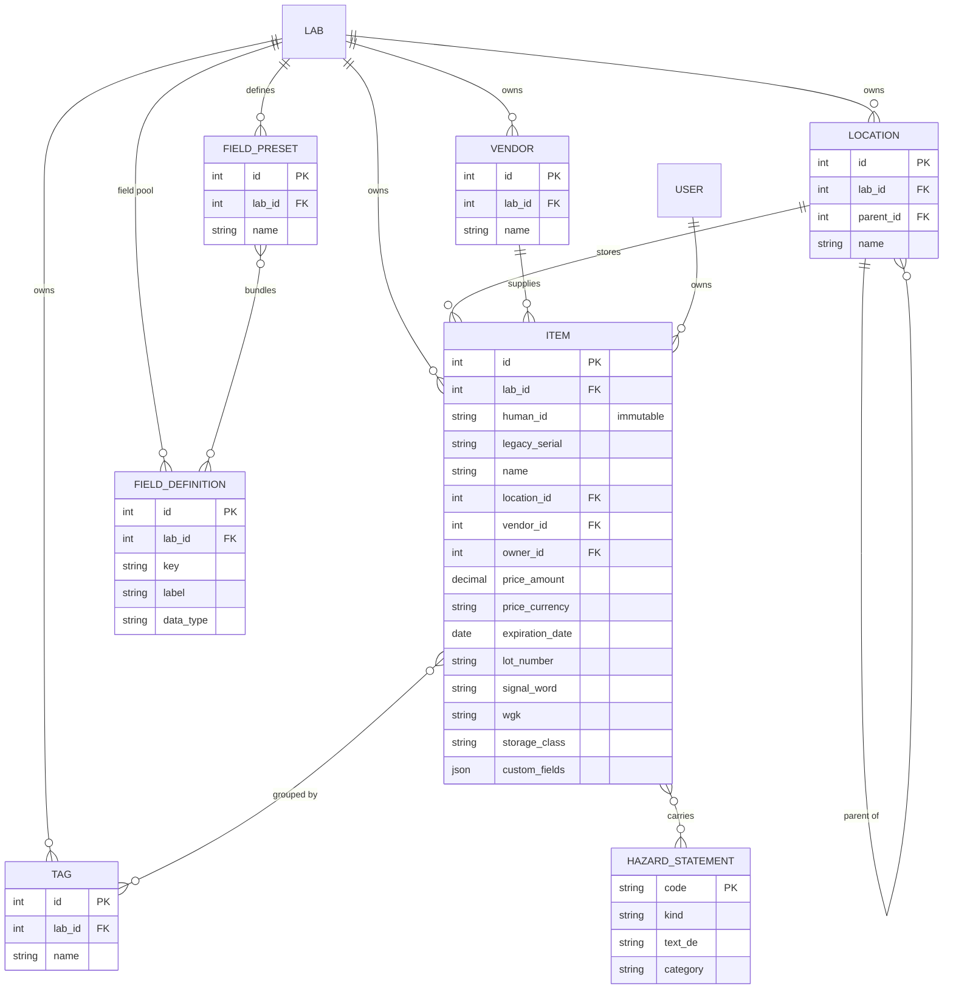
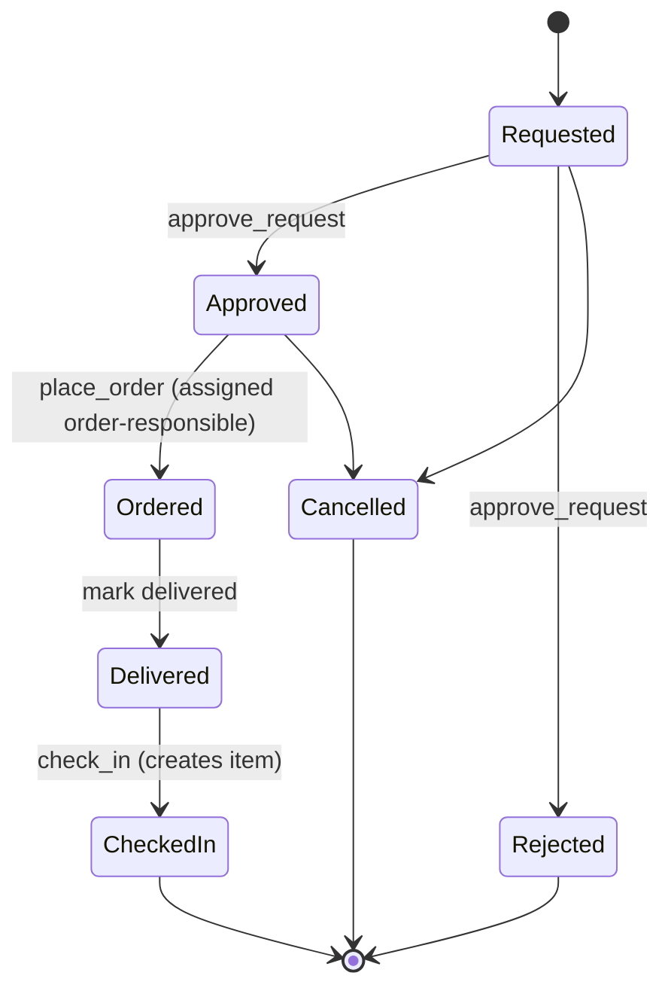
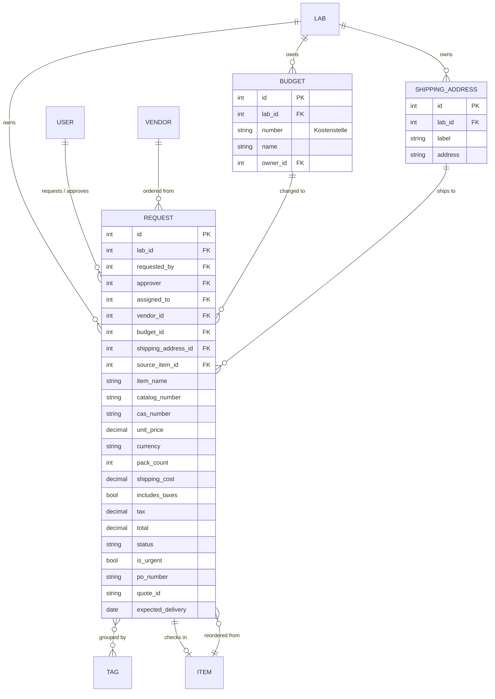
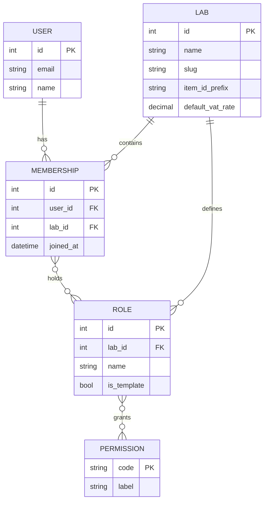

# LabButler — Conceptual Spec & MVP Outline

*A free, self-hosted, Docker-deployable alternative to LabSuit for lab inventory and order procurement. (Name pending final domain/namespace reservation: `labbutler` is open on PyPI, npm, and GitHub; confirm the domain at a registrar.)*

---

## 1. Purpose & scope

A self-hosted web application that lets a research lab manage (a) its **inventory** of physical items and (b) its **procurement workflow** (request → approval → order → delivery → check-in), with a shared, searchable record so the group avoids duplicate orders and can track spending per cost centre.

It targets a single institute/lab that wants to leave LabSuit, keep its data, and run everything locally without per-seat fees or a vendor shop.

## 2. Goals / non-goals

**Goals**
- Replace LabSuit's two core modules (inventory + requests) with a cleaner data model.
- Migrate existing LabSuit data via spreadsheet import without relabelling physical containers.
- Multi-lab capable from the start, but collapsible to a single lab at zero cost.
- Granular, lab-defined permissions.
- Immutable audit trail of all transactions.
- **Responsive UI that works on both mobile devices and desktop monitors** — phones and tablets at the bench (check-in/out, quick lookups, scanning) and full-width monitors for management, import, and reporting. Mobile-first layout, touch-friendly targets, no horizontal scrolling on small screens; tables collapse gracefully to card/stacked views.

**Non-goals (now, possibly ever)**
- No vendor shop / catalog / PunchOut integration.
- No accounting-grade billing. Totals are rough estimates for eyeballing against the university's real invoices; the university does the actual billing.
- No SSO in the MVP (local accounts only).

## 3. Tech stack & deployment

- **Django** + **PostgreSQL** (JSONB is required for flexible custom fields; SQLite is not sufficient).
- Server-rendered UI (Django templates + HTMX) for the MVP — simple and fast to build. **Responsive/mobile-first** (e.g. a utility CSS framework like Tailwind, or Bootstrap) so the same interface works on phones, tablets, and large monitors.
- **Celery + Redis** for scheduled and async work (expiry digests, outbound email, large imports).
- **Docker Compose** services: `web`, `db` (Postgres), `worker` (Celery), `broker` (Redis), plus a **media volume** for attachments (SDS/MSDS PDFs). Email via SMTP.

## 4. Tenancy model

- `Lab` is the top-level container and the scoping anchor: nearly every record carries a `lab_id`, and every query is lab-scoped.
- A **single-lab deployment is just one `Lab` row** — no special-casing, nothing lost if multi-lab is never used.
- A user can belong to multiple labs; the UI operates on one **active lab** at a time (a session concept). Switching labs re-scopes everything and swaps in that lab's permissions.
- An **Institute** tier above `Lab` is deferred (Phase 2). Explicit cross-lab sharing (below) does not require it.

## 5. Identity & naming

The hard rule, learned from LabSuit's `ch-2321`-changes-on-reclassification bug:

> **An identifier is never recomputed from any field that can change.**

Three separate concepts, kept separate:

- **Identity** — an internal surrogate key (auto-increment / UUID). Never shown, never changes.
- **Human identifier** — assigned **once at creation and frozen forever**, type-independent. New items get `{LAB_PREFIX}-{running number}`, e.g. `AGB-04821`. This is what goes on the container and barcode. It stays short, memorable, and searchable.
- **Barcode / Data Matrix** — the human identifier is also carried on the physical label as a **Data Matrix (ECC 200)** encoding *only* the human ID (e.g. `AGB-0001`). Data Matrix is chosen over QR / 1-D because it stays readable at ~1 cm on small, round, curved chemical containers. Labels are **preprinted externally** on off-the-shelf sheets (e.g. HERMA 189-up) — LabButler does **not** run a print service — laid out as in the mock-up: Data Matrix on the left, the human-readable ID (large) on the right.

Type/classification is *not* part of the identifier. The UI may show a cosmetic tag-derived hint next to the number, but it follows the current tags and never alters the stored ID.

**Assigning IDs at check-in.** Because labels are preprinted and handed out, the ID is *chosen*, not silently auto-incremented: when an item is created / checked in the user picks the ID that's physically on the container rather than always taking the next number. The UI suggests the next ~10 free IDs after the highest one used (preprinted labels can be skipped or lost, so gaps are fine) and also accepts a manually-typed `{PREFIX}-NNNN`, validated for uniqueness within the lab before saving. Once chosen the ID is frozen forever (the hard rule above). Imported legacy serials are unaffected.

**Migration:** imported items **keep their original LabSuit serial** (`ch-0005`) as their frozen human identifier — searchable, never recomputed — so no physical container is relabelled. Only *new* items use the `{LAB_PREFIX}-…` scheme. Legacy serials collide across former types (e.g. `co-0001` in two sheets); that's fine because the surrogate key carries identity and the serial is just a searchable label.

## 6. Roles & permissions

- **Permissions** are a fixed, global catalog of capabilities.
- **Roles** are defined *per lab* (each lab invents its own — "PhD student", "TA", "Postdoc") and are composed by checking/unchecking permissions.
- A user's **effective rights in the active lab = the union** of the permissions across the roles on that lab membership.
- **Template roles** (`is_template`) ship as starter sets and are cloned into editable, lab-owned roles at lab creation. No installation-wide role ever governs behaviour.
- Enforcement goes through a single helper, e.g. `user.can(lab, "approve_request")`, which resolves membership → roles → permissions for the active lab.

**Permission catalog (MVP)**

| Permission | Purpose | Explicitly requested |
|---|---|---|
| `view_inventory` | See inventory | yes |
| `view_requests` | See requests | yes |
| `manage_inventory` | Create/edit/delete items, fields, presets, locations, tags | — |
| `import_inventory` | Run spreadsheet imports | — |
| `create_request` | Raise a request | — |
| `approve_request` | Approve a request | yes (approve order) |
| `place_order` | Mark approved request as ordered | yes (ordering) |
| `check_in` | Receive/check items into inventory | yes |
| `check_out` | Consume/remove items from inventory | yes |
| `manage_lab` | Members, roles, suppliers, budgets, shipping addresses, settings | — |

## 7. Inventory model

**No item-type entity.** "Type" was doing two unrelated jobs; both are handled better separately:

- **Classification/grouping → tags.** Tags are multi-membership, so an antibody can be tagged both `antibody` and `protein` with no taxonomy to argue about. On import, each LabSuit sheet name becomes a tag on its rows.
- **Field schema → a lab-level custom-field pool.** Custom fields (`FieldDefinition`: key, label, data type) are defined once per lab and may be used by any item; values live in `Item.custom_fields` (JSONB, GIN-indexed for search). **Field presets** are optional named bundles ("Chemical fields") that, when applied, simply add those fields to an item — pure convenience, never stored as identity or classification.

**Other inventory facts**

- **Container-level:** one record = one physical container (one number, one container). Batch "generate N containers" is a Phase 2 convenience.
- **Locations** are hierarchical (self-referential `parent_id`; three levels in practice — room → fridge/freezer → tray). Import normalises dirty location strings and the `(NNN)` room-number convention.
- **Hazard / H-P data is a global structured catalog**, not freeform tags. `HazardStatement` (code, kind H/EUH/P, `text_en`, `text_de`, category) is shared installation-wide; items link to it many-to-many. **Signal word** (normalised Warning/Danger), **WGK** (Wassergefährdungsklasse) and **Lagerklasse** (TRGS 510 storage class) are structured fields. Import parses these out of LabSuit's comma-separated `TAGS` soup; genuine leftovers (years, project names) stay as tags.
- **Vendors/Suppliers** are a simple name, quick-created inline during ordering. A merge/cleanup tool for typos is Phase 2.
- **Attachments** (SDS/MSDS, quotes) stored on the Docker media volume.

## 8. Procurement / requests

**A request is a single item** (no multi-line). Duplicating a request with the supplier pre-filled is a UI convenience, not a data structure.

**Cost handling (rough by design)**
- Fields: `unit_price`, `currency`, `pack_count`, `shipping_cost`, `includes_taxes` (bool), derived `tax`, derived `total`.
- A **lab setting** holds the default VAT rate (19%). Tax is **auto-calculated**, never hand-typed.
- If `includes_taxes` is **off**: `tax = (unit_price × pack_count + shipping_cost) × vat_rate`; `total = subtotal + tax`.
- If `includes_taxes` is **on**: the entered price is gross; `total` is taken as-is and `tax` is shown only as an informational back-calculation.
- Totals are estimates for comparison against the university's real invoices — not accounting-grade.

**Cost centre** — `Budget` (Kostenstelle / grant number, name, optional owner) is a first-class, maintained list. Each request is **charged to one budget**, which drives per-KST expense reports. Tags remain available for looser grouping.

**Other procurement entities & fields**
- `ShippingAddress` (first-class) — a request ships to one.
- Approver routing ("select approving persona") and **defer to an order-responsible person** (`assigned_to` + `place_order` permission).
- `PO #`, `Quote ID`, `urgent` flag, product URL, expected delivery, comment, attachments.
- **Reorder:** create a request pre-filled from an existing item.

**Workflow state machine** — approval is separate from ordering; on check-in the request **creates the inventory item(s)** (container-level) and links them back.

## 9. Audit log

A single **append-only, immutable** `AuditEntry` (actor, timestamp, lab, action, target type, target id, `changes` JSONB) — written once, never edited or deleted in app code. It captures all transactions: request state changes, check-in/out, approvals, role/member/budget/supplier edits, and imports.

## 10. Spreadsheet import (MVP-critical)

Import is what makes the system usable on day one, and it forces the model to be right.

- **Two paths:** a built-in **LabSuit profile** that knows the export layout (the export doubles as LabSuit's re-import template — note the `Delete? (y/n)` / `In stock? (y/n)` control columns and the `Import Instructions` sheet), plus a **generic column-mapper** for other sources.
- **Per-sheet handling:** each sheet's shared core columns map to standard fields; each sheet's extra columns populate the lab-level custom-field pool; and the **sheet name becomes a tag** on its rows.
- **Parsing rules grounded in the real export:**
  - **Price** is messy (`235`, `18.80EUR`, `EUR 109.00`, `110.00USD`, `$ 500.00`, `EUR 1,249.00`): parse amount + currency, prefix or suffix, comma thousands.
  - **Dates** are European `DD-MM-YYYY`.
  - **Locations** are 3-level and dirty (`Storage room (376)` vs `Room 376` vs `376`): build the hierarchy, normalise, surface a review step.
  - **Owner** is an email → map to a user/membership (create stub if needed).
  - **TAGS** are split into GHS H/EUH/P codes (→ hazard catalog), signal word (normalise `Achtung`/`Gefahr`/`Warning`/`Warnung`), WGK, Lagerklasse, and genuine freeform tags.
  - `AMOUNT_IN_STOCK` may be non-numeric (`empty`); junk rows exist (an item literally named "test").
- **Dedup key:** legacy serial within a lab (collisions across former types tolerated; surrogate key carries identity).
- **Dry-run preview** before commit: "1,840 OK, 28 warnings, 6 errors".
- **German CSV** variant: semicolon-delimited, comma decimals, possible latin-1 encoding.

## 11. Notifications

- Email only (SMTP).
- Request **status changes** notify the involved people.
- **Expiry** digest for items that have an `expiration_date` set (expiry is optional — set only for items that matter).
- **Low-stock alerts are deferred** (Phase 2).

## 12. Auth / membership data model (reference)

## 13. Roadmap

**MVP**
- Tenancy (multi-lab, single-lab collapsible) · local auth · per-lab roles & permissions.
- Inventory: items (immutable IDs), lab-level custom-field pool + presets, tags, hazard catalog (H/P/EUH + WGK + Lagerklasse), hierarchical locations, attachments.
- Import: LabSuit profile + generic mapper, with dry-run preview.
- Requests: single-item, full workflow, KST budgets, suppliers, shipping addresses, approver routing & defer-to-order-responsible, reorder, auto-tax.
- Immutable audit log.
- Email notifications: status changes + expiry digest.

**Phase 2+**
- Cross-lab inventory sharing: owner-side `SharingGrant` (recipient labs + visibility level + scope) AND searcher-side `cross_lab_search` permission; **read-only discovery**, both sides must consent.
- Institute tier · low-stock alerts · batch container generation.
- Auto H-P lookup by CAS via **PubChem / ECHA free APIs** (likely no paid AI needed) · vendor & tag cleanup/merge tools.
- **Mobile Data Matrix scanner** — scan the preprinted label on a phone to look up / check in / check out an item, in-browser via the `BarcodeDetector` API (Android/Chrome) with a ZXing/bwip-js fallback (iOS Safari). Decodes only the human ID. No native app required. A later **"convert" tool** may re-label legacy imported serials onto the new `{PREFIX}-NNNN` + Data Matrix scheme.
- **Label-sheet generator (admin)** — a Print-Label admin page that lays out a printable **template for off-the-shelf sticker sheets** (e.g. HERMA 189-up), rendering each cell as **Data Matrix (left) + human-readable ID (right)** for a chosen range of reserved IDs, so a lab prints its own sheets and hands out labels. Complements (does not replace) buying preprinted sheets.
- SSO/LDAP · scheduled email data-backup/export · configurable ordering workflow · actual-invoice reconciliation field.

## 14. Open / minor items

- ~~Project name.~~ **Resolved: LabButler.** (Reserve domain + PyPI/GitHub/Docker Hub.)
- Whether shipping cost is inside the tax base (assumed yes; rough either way).
- Multi-currency in reports: report per-currency, or convert at a stored rate? (Rough tolerance applies.)
- Exact split between `approve_request`, `place_order`, and the order-responsible assignment.