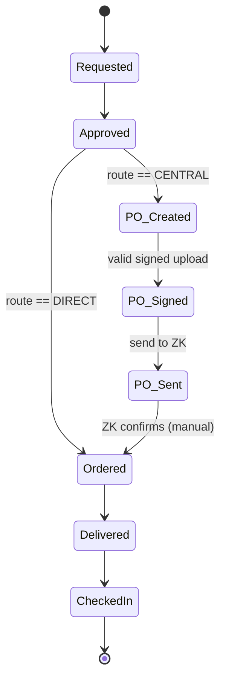

# Build Spec — Central Purchasing (Zentraleinkauf) Route

**Feature branch:** `feature/central-purchasing-route` (branch off the current mainline; single self-contained branch, no dependency on other in-flight work)

**One-line scope:** Add an optional Zentraleinkauf route to the procurement state machine, a suggestion engine that nudges but never mutates, a PO artifact lifecycle with client-side signing, and the audit trail that ties it together.

**Phasing (v1 = this branch).** v1 implements the route machinery and the means to **store and organize** the Beschaffungsantrag PDFs: unsigned upload → email the signer with a direct link → signed upload to the same order → "PO wartet auf Signatur" action on the dashboard. All PDF *processing* is **v2**: `document_token` stamping, pyHanko signature validation, `signer_identities` extraction, PDF.js preview, prefill. In v1 the signed upload is trust-based — a human says it's signed; the system organizes and audits, it does not verify. Sections below marked **[v2]** are specced now, built later.

---

## 0. Core principle (read first — every decision below follows from it)

LabButler **computes and suggests; it never mutates procurement state on the basis of financial values.** Route changes are always a manual human action. State is a function of explicit transitions plus external-edge locks. Money (net total, price drift) only ever produces a *nudge*, never a state change.

Two consequences that recur throughout:
- Route suggestion and PO-refresh suggestion are **two independent triggers** — surface them separately.
- The system's job at the friction points is to make the *fact* auditable, not to force *justification work*.

---

## 1. Data model changes

### Request (or the procurement record)
- `procurement_route` — enum `DIRECT | CENTRAL`. Enum, not bool (room for a third route later). Default resolved from `suggest_route()` at creation but freely editable.
- `zk_order_number` — nullable string, captured when `Ordered` is set on the CENTRAL route.

### Vendor
- `country` — ISO 3166 alpha-2 code, **nullable** (existing vendors have none). Used for the EU / non-EU determination in `suggest_route()`; a vendor without a country contributes **no signal** (threshold-only suggestion, never a country nudge). Small migration; add now.
- **Vendor admin panel:** a manage-area page (gated `manage_lab`, following the existing `manage_views` pattern) listing the lab's vendors with an editable country field, so EU/non-EU can be maintained after the fact.

### PurchaseOrder artifact (new)
The PO PDF is always the **official Zentraleinkauf order form** — LabButler never renders its own PO document. It enters the system by **upload** (requester/PC fills the official form outside LabButler); optionally, later, LabButler may offer a **prefilled** version of the official form (§13).
- `id`, FK to request
- `po_snapshot_net` — net total frozen at creation time, taken **from the request's fields, never parsed out of the PDF**. This is the **baseline** for the 15 % deviation check. Do not recompute it; it is the point-in-time snapshot.
- `status` — `active | superseded`
- `unsigned_pdf` / `signed_pdf` — file refs
- `document_token` **[v2]** — opaque id stamped into the PDF's XMP/Info metadata at creation; used to verify a re-uploaded PDF belongs to this order. v1 stores files without stamping.
- `signer_identities` **[v2]** — CN/email of every signature on the upload (the official form carries up to three: Antragsteller, Budgetverantwortlicher, D7), extracted by pyHanko; JSON list. v1 records only *who uploaded* the signed file (audit actor).
- timestamps

### Audit (append-only; extends existing log)
Event types — see §8.

---

## 2. State machine

### Transition guards & actors
| From | To | Guard | Actor (permission) | Notes |
|---|---|---|---|---|
| Approved | Ordered | `route == DIRECT` | `place_order` (existing) | direct order placed |
| Approved | PO_Created | `route == CENTRAL` | `create_po` | official form uploaded (later: prefilled); stamps token + freezes snapshot |
| PO_Created | PO_Signed | signed file uploaded | `sign_po` (upload actor) | v1: trust-based; **[v2]** pyHanko validation + token match |
| PO_Signed | PO_Sent | — | `send_po_to_central` | manual button; records the fact only, no system email (§7) |
| PO_Sent | Ordered | — | `place_order` (existing) | manual; captures `zk_order_number` |
| Ordered | Delivered | — | existing | |
| Delivered | CheckedIn | — | existing | |

Both routes converge at `Ordered` and share `Delivered → CheckedIn` unchanged.

### `Ordered` semantics
- CENTRAL: set **manually** when the request manager receives the ZK confirmation in their normal inbox and a `place_order` holder clicks "ZK hat bestätigt". No inbound email parsing anywhere in this feature.
- DIRECT: set manually when the order is placed.

### Mutable vs locked zones (route changes)
- **Mutable** (route may still change): `Approved`, `PO_Created`, `PO_Signed` — nothing has left the organization.
- **Locked** (route immutable): from `PO_Sent` onward (external commitment) and `Ordered`+. Beyond the lock, a route change is not re-routing — it is a **cancellation** (separate workstream, §9).

### `Cancelled` terminal — model now, implement later
Model `Cancelled` as a terminal state reachable (in principle) from any non-terminal state, so the machine is **not** wired as a strictly linear chain. Do **not** implement the cancellation transitions/cascade in this branch — just leave the terminal and the "not strictly linear" shape in place so §9 is later an additive change, not a rewrite.

---

## 3. Re-routing (manual, mutable zone only)

Route changes are always manual and require permission `reroute_procurement`. Allowed only while state ∈ {`Approved`, `PO_Created`, `PO_Signed`}.

**Canonical reset:** any reroute sets state back to `Approved`.
- `DIRECT → CENTRAL`: state was already `Approved`; opens the CENTRAL branch.
- `CENTRAL → DIRECT` while a PO exists: archive the existing PO as `superseded`, state returns to `Approved`. The PO is moot on the direct path.

Every reroute writes a `route_changed` audit event (§8).

---

## 4. Suggestion engine — two independent pure functions

Neither function mutates anything. Both return a nudge payload for the UI.

### `suggest_route(request) -> (suggested_route, reasons[])`
Runs on save of price- or vendor-relevant fields.
- Suggest `CENTRAL` if **net total > threshold** OR **vendor is non-EU**.
- Vendor without a `country` set → **no country signal at all** (only the threshold can trigger); never nudge on unknown origin.
- `reasons[]` is human-readable and shown to the user, e.g. `["Netto 1.240 € > Schwelle 1.000 €", "Lieferant Non-EU (US)"]`.
- Basis is **net**, never gross. Requests are single-item: net = `total − tax` (derived via `recalculate_totals`); expose a `net_total` accessor rather than storing a new field.
- Threshold and EU-country list are **config**, instance default with per-lab override (§9) — not hardcoded.

### `suggest_po_refresh(po, current_net) -> (should_refresh, deviation_pct)`
- `deviation_pct = |current_net − po_snapshot_net| / po_snapshot_net`
- Nudge "PO veraltet — neu erstellen?" when `deviation_pct > po_deviation_threshold` (default 15 %).
- POs carry approximate prices, so sub-threshold drift is noise → no nudge.
- Recreation is **user-initiated**: archives the old PO as `superseded`, and a new PO is created the same way as the first (new upload of the corrected official form — or new prefill, later; new snapshot + token). If the old PO was signed, recreation implicitly means re-signing — still a suggestion, never forced.

These two are **decoupled**: a 12 % rise can cross the route threshold (route nudge, PO still fine); a 20 % rise can stay on the same side of the threshold (PO nudge, route unchanged). Render them as separate nudges.

### Post-approval editability (deferred, but design for it)
Today requests are **locked for editing after approval** — that stays in this branch. Making price/vendor fields editable in the mutable zone is a later change. Consequence: `suggest_po_refresh` is not reachable through the UI yet; still implement and unit-test both engines as **pure functions over current field values**, computed at render/save time (never cached into state), so unlocking edits later requires zero changes here. Nothing in the models or services may assume post-approval immutability.

---

## 5. Route override & audit (the one intentional friction point)

Triggered when a user proceeds **DIRECT despite a CENTRAL suggestion** (recommended central → chose/kept direct).

- The **event is mandatory**; the **reason is not.**
- No blocking dialog. The system *always* writes the `route_suggestion_overridden` event (actor, timestamp, `from_route → to_route` / "kept direct against suggestion") — this is not suppressible.
- Reason = enum (`emergency`, `known_below_threshold`, `vendor_exception`) + freetext, **may be left empty**, does not hold up the action. An emergency at 23:00 costs one click, not a form.
- An empty reason is itself a signal. Support the query "overrides with no reason" and "override frequency by user/lab" — the event carries the decisive info regardless of whether the reason field is filled.

Make the override reason mandatory-event / optional-field **only in this direction** (recommended central → chose direct). Nowhere else.

---

## 6. PO artifact lifecycle & signing

Signing is **client-side only.** The server never holds a private key.

**The concrete form** (UzK "Beschaffungsantrag an die Abteilung 64 – Einkauf", versioned, e.g. "Version vom 03.05.2025"): an interactive fillable PDF (reset/completeness-check buttons, calculated sum fields), all amounts **net** ("sämtliche Beträge sind netto anzugeben"), up to 7 positions, a Drittland (non-EU) section, and **digital signature fields for Antragsteller and Budgetverantwortlicher, plus D7 (Projektmanagement) for Drittmittel**. LabButler treats the form as a black box: it **never alters visible content or fields** — the only modification ever made is the invisible `document_token` in the PDF metadata, stamped as an incremental update so form structure (and any Reader-enablement) survives intact.

### v1 flow (this branch — store & organize, no PDF processing)

1. **Fill support — copyable summary.** On a CENTRAL-route request, the detail page shows a **form-fill summary**: the request's values laid out in the order the Beschaffungsantrag asks for them (requester name/email, Lieferanschrift, Kostenstelle, position description, Menge, net unit price, net total, vendor name + country), each with a **copy-to-clipboard button** (plus copy-all). This is the manual bridge until prefill (§13) exists — filling stays outside LabButler, but nobody retypes.
2. **Create** (`Approved → PO_Created`): the **request manager** uploads the filled official form (HTMX drop-zone). *Request manager* = the request's assignee (`forward_to`) if it was forwarded, **else the original requester** — always a specific person on this request, never "some PC of the lab". On upload LabButler freezes `po_snapshot_net` from the request's current fields and stores the file as `unsigned_pdf`. No inspection of the PDF in v1.
3. **Notify the signer:** email to the `sign_po` holders (Lab manager by default) via the existing `apps/notifications` builder + Celery task pattern: "PO wartet auf deine Signatur", with a **direct link to the order**. The email never attaches the PDF — the artifact stays in LabButler. Additionally the **dashboard** shows a "PO wartet auf Signatur" action item for `sign_po` holders (existing `dashboard.html` action-list pattern) until `PO_Signed`.
4. **Sign:** signer downloads the PDF from the order page, signs in Acrobat with the institutional certificate (X.509 `.p12` as PAdES), saves. The form expects **two signatures** (Antragsteller, Budgetverantwortlicher; plus D7 at Drittmitteln) — order and completeness are **organizational**; LabButler does not enforce who or how many.
5. **Upload signed** (`PO_Created → PO_Signed`): the signer uploads the signed file to the **same order** (drop-zone on the linked page) → stored as `signed_pdf`, audit `po_signed` with the upload actor. **Trust-based in v1** — no signature verification.

`sign_po` is a **permission**, defaulting to the Lab manager role — not a hardcoded person (institutions vary on signing authority).

### [v2] Validation & preview (specced, deferred)

- **Token:** stamp `document_token` into Info/XMP at create (incremental update; form structure and any Reader-enablement survive), reject already-signed PDFs at create, verify token match on the signed upload — forces signers through LabButler's download and proves the signed file belongs to this order.
- **pyHanko validates synchronously** on the signed upload: ≥1 signature present; every signature covers its revision / document intact (cryptographic integrity — needs no CA); extract all signer identities → `signer_identities`. **No chain/CA validation** — we don't manage certificates in the webapp; trust in *who* signed is organizational. Reject on: no signature ("unsignierte Version hochgeladen"), token mismatch (wrong PDF). Success shows "Signiert von <name>, gültig ✓".
- **Preview:** read-only PDF.js embed on the order detail page (vendored locally, no CDN). v1 offers download links only.
- PAdES signs via incremental update, so original bytes (and the token) survive signing.

---

## 7. Send to Zentraleinkauf

- **LabButler never emails ZK.** The transition `PO_Signed → PO_Sent` stays a **manual** "An Zentraleinkauf senden" button that merely **records the fact** (transition + audit event). This *is* the control checkpoint the whole extra round exists for.
- **Forward-ready email (v1).** To make the manual send one action instead of four, on reaching `PO_Signed` LabButler emails the **request manager** (the person managing *this* request: `forward_to` assignee if set, **else the original requester** — never broadcast to a role) a message they can **forward to ZK as-is**:
  - Subject: `Beschaffungsantrag <request ref>`
  - Body (pure ZK-facing text, no internal instructions — anything in the body gets forwarded):
    > Lieber Zentraleinkauf,
    >
    > anbei finden Sie einen Beschaffungsantrag mit der Bitte um Bearbeitung.
    >
    > Mit freundlichen Grüßen
    > <display name of the recipient/forwarder>
  - **Attachment: the signed PDF.** This is a deliberate, narrow exception to §11's no-attachment rule — without it, "just forward" doesn't work. The attachment goes only to the internal user who could download it anyway; it still never goes from LabButler to ZK.
  - The signature uses the *recipient's* name (they are the sender ZK sees), not the signer's.
  - A "Mail erneut an mich senden" button on the order page re-sends it (reassigned request, lost mail) — always to the *current* request manager.
  - Workflow: receive mail → forward to ZK from own mailbox → click "An Zentraleinkauf senden" in LabButler → `PO_Sent`.
- Direct system-to-ZK sending (and auto-send on signed upload) remains **deferred** (§13).

---

## 8. Audit events (append-only)

- `state_transition` — from, to, actor, ts
- `route_changed` — from, to, actor, ts, reason_enum?, reason_text?
- `route_suggestion_overridden` — context (net, vendor, suggested route), chosen route, actor, ts, reason_enum?, reason_text?
- `po_created` — po_id, snapshot_net, token, source (`uploaded` | `prefilled`)
- `po_superseded` — po_id, cause (`recreated` | `rerouted`)
- `po_signed` — po_id, upload actor; **[v2]** signer_identities + validation result
- `po_forward_email_sent` — po_id, recipient (internal user), ts (initial send and every re-send)
- `po_sent_to_zk` — actor, ts (records the manual "sent" fact; no ZK recipient, since sending happens outside the system)
- `ordered` — zk_order_number?

---

## 9. Configuration

**Mechanism:** instance defaults live in Django settings (env-driven, as everything in `settings.py`); per-lab overrides are **nullable fields on `Lab`** (null = use instance default), edited via the existing lab settings screen (`LabSettingsForm` / `manage_views.settings` pattern — same as `default_vat_rate`). No new config framework.

- `central_purchasing_threshold_net` — default `1000` (EUR), per-lab override
- `eu_country_list` — instance-level (settings/env), default = EU-27; no per-lab override needed
- `po_deviation_threshold_pct` — default `15`, per-lab override
- ~~`auto_send_to_zk`~~ — dropped; no system email to ZK in this branch (§7, §13)

---

## 10. Permissions (added to the global catalog, composable per lab)

New: `create_po`, `sign_po` (default Lab manager), `send_po_to_central`, `reroute_procurement`.
Upload rule: the unsigned-form upload is prompted from (and allowed for) the **request manager** (`forward_to` assignee, else the requester — §6); `create_po` holders may also upload. The forward-ready email (§7) goes **only** to the request manager, never to a role.
**Reuse existing `place_order`** for both `Approved → Ordered` (direct) and `PO_Sent → Ordered` — do **not** add a `mark_ordered` codename.
Add via the established pattern: entry in `apps/tenancy/catalog.py` + data migration seeding the `Permission` rows and granting to existing roles (cf. migration `0011_accept_forwards_permission`). Template-role defaults: `sign_po` → Lab manager (already `"*"`); `create_po`/`send_po_to_central` → also grant to roles holding `place_order` (Purchase coordinator).

---

## 11. Handoff-channel invariant (holds across the whole feature)

- **Internal** handoffs (PO_Created → Lab manager, PO_Signed → request manager) = **email notifications to the respective user** (there is no in-app notification system; the `apps/notifications` email pattern *is* the in-app channel). Emails link into LabButler and carry no attachments — **with one deliberate exception**: the forward-ready ZK email (§7) attaches the signed PDF, because its whole point is to be forwarded verbatim. It still goes only to an internal user.
- **Outbound to ZK** = **none from the system** in this branch. The request manager forwards the ready-made email from their own mailbox; LabButler only records `PO_Sent`.
- **Inbound** (ZK confirmation → `Ordered`) = **manual human action.** No IMAP poller, no inbound webhook, no attachment parsing.

---

## 12. Acceptance scenarios (target corridor for testing-based debugging)

1. **Direct small order.** Net 200 €, EU vendor → `suggest_route` = DIRECT. `Approved → Ordered → Delivered → CheckedIn`, no PO ever created.
2. **Central happy path (v1).** Net 1.500 € → suggest CENTRAL → user sets CENTRAL → request manager (`forward_to` assignee, else requester) copies values from the form-fill summary, fills the official form, uploads → snapshot 1.500 frozen, `PO_Created` → signer emailed with link + dashboard shows "PO wartet auf Signatur" → Antragsteller + Budgetverantwortlicher sign, Lab manager uploads signed file → `PO_Signed` (upload actor audited) → request manager receives the forward-ready email (signed PDF attached, ZK letter body), forwards it to ZK from their own inbox, clicks "An ZK senden" → `PO_Sent` (fact recorded, LabButler never emailed ZK) → ZK confirms, `place_order` holder sets `Ordered` + `zk_order_number` → `Delivered → CheckedIn`.
3. **Late slip into central.** `Approved`, route DIRECT, net edited 900 → 1.500 → `suggest_route` nudges CENTRAL (no auto-change) → user manually switches → `route_changed` event → CENTRAL path proceeds. *(Post-approval editing is deferred — cover at the service/pure-function level now; the UI corridor activates once editing lands.)*
4. **Emergency override.** Net 1.500 €, suggest CENTRAL, user keeps DIRECT → mandatory `route_suggestion_overridden` event written, reason left empty, action proceeds → `Ordered`. Query "overrides without reason" returns this record.
5. **PO refresh.** Snapshot 1.000 €, price rises to 1.180 € (+18 %) → `suggest_po_refresh` nudge → user recreates → old PO `superseded`, new PO generated (re-sign implied). Separately: rise to 1.080 € (+8 %) → no nudge. *(Same caveat as scenario 3: pure-function/service tests now, UI once post-approval editing lands.)*
6. **Bad uploads [v2].** At the signing step: unsigned PDF → pyHanko "keine Signatur" → rejected, stays `PO_Created`; wrong PDF (token mismatch, e.g. a signed local copy instead of the stamped download) → rejected. At the create step: an already-signed PDF → rejected ("bitte unsignierte Version hochladen"). *(v1 accepts any PDF at both steps — trust-based.)*
7. **Reroute back in mutable zone.** State `PO_Signed`, route CENTRAL → user reroutes to DIRECT → state resets to `Approved`, existing PO archived `superseded`, `route_changed` event.
8. **Lock respected.** State `PO_Sent` → reroute attempt blocked (locked zone). Only forward path is `Ordered` (or cancellation, deferred).
9. **Unknown vendor country.** Net 800 €, vendor without `country` → no nudge of any kind (threshold not crossed, no country signal from unknown origin).

---

## 13. Explicitly deferred (NOT in this branch)

- **All PDF processing [v2]:** `document_token` stamping (pikepdf), pyHanko signature validation + `signer_identities`, reject-signed-at-create / reject-unsigned-at-sign, PDF.js preview. v1 stores and organizes PDFs without opening them.
- **Post-approval editing of requests** (price/vendor fields in the mutable zone). Prepared for here — engines are pure over current values — but the edit lock stays.
- **Any outbound email to Zentraleinkauf** (incl. the `auto_send_to_zk` option). Sending is manual, outside the system, for now.
- Full **Cancellation** workflow: transitions into `Cancelled`, and the post-`PO_Sent` cascade (cannot silently roll back a PO already sent to ZK). Terminal is modeled now (a `cancelled` status and ownership-gated cancel transition already exist in the codebase — reconcile reachability from the new PO states when the cascade lands); transitions from PO states land in a later branch.
- **Prefilling the official ZK order form.** LabButler fills the institution's form template from the request and offers it for download, token already embedded. Upload of a manually filled form is the supported path in this branch and **remains supported even once prefill exists**. Design sketch for when it lands:
  - **Generic, not UzK-specific.** Every lab/institution has its own form, so prefill is a **mapping layer**, not hardcoded field names — directly analogous to the existing generic mapper in `apps/imports` (LabSuit profile + generic mapper).
  - LabButler defines a small set of **semantic keys** (`requester_name`, `requester_email`, `cost_center`, `delivery_address`, `position_1_description`, `position_1_qty`, `position_1_unit_price_net`, `vendor_name`, `vendor_country`, …).
  - A lab admin uploads their blank form template; LabButler **parses and lists the PDF's field names** and the admin maps semantic keys → form fields in a UI (shippable per-lab profiles for known forms, e.g. UzK Abt. 64).
  - Prefill only ever fills existing fields — it never restructures the form. Template + mapping are **version-sensitive** (the UzK form carries a "Version vom" date and will churn); a new form version means re-uploading the template and touching up the mapping.
  - Mechanism depends on the form's internals (AcroForm vs XFA); see §14 note.
- Cross-lab inventory sharing (Phase 2, unrelated).
- Any inbound-email automation.

---

## 14. Stack mapping (for orientation)

- **State machine:** extend the existing plain status `CharField` + declarative `TRANSITIONS` table in `apps/procurement/services.py` (no `django-fsm`; matches how the app already works).
- **No PDF generation, and in v1 no PDF processing at all:** the PO is always the official ZK form, uploaded by the user (later: prefilled, §13). **v1 adds zero new Python dependencies.** [v2]: **pikepdf** stamps `document_token` into Info/XMP and detects pre-existing signatures; **pyHanko** validates signatures on upload (integrity + coverage + identity extraction + token match, no CA/chain validation, §6). reportlab stays for label printing only — it plays no role here.
- **Preview [v2]:** **PDF.js**, vendored locally under `labbutler/static/vendor/` like htmx/zxing — CDN loading is forbidden (CLAUDE.md). v1: download links only.
- **Files:** follow the `apps/attachments` pattern — `FileField` under MEDIA with randomized path, permission-gated download view; never web-served directly.
- **Notifications:** existing `apps/notifications` email builders + `@shared_task` Celery pattern for the internal signer/PC handoff emails. The forward-ready ZK email (§7) is the one mail with an attachment — extend the `_send` helper (`EmailMultiAlternatives.attach()`) for it. No outbound ZK email (§7). Dashboard action item via the existing `dashboard.html` action-list pattern.
- **UI:** HTMX drop-zones for both uploads; out-of-band swaps for the two independent nudges; form-fill summary with copy-to-clipboard buttons (`navigator.clipboard`, no library needed).
- **Audit:** `AuditEntry.record()` (append-only, JSON `changes`) for every §8 event — `action` is a free string, no model change needed.
- **Config:** settings/env instance defaults + nullable `Lab` fields for per-lab overrides (§9).
- **Deferred PO-form prefill (§13):** per-lab template + semantic-key field mapping, modeled on the `apps/imports` generic mapper. Inspect the template with `pypdf` — AcroForm fields → enumerate via `get_fields()` and fill via `pypdf`; flat PDF → reportlab overlay merged onto the template; XFA (LiveCycle) forms have no good Python story and would need the overlay fallback. The UzK form is interactive (reset/check buttons, calculated sums) — AcroForm vs XFA still needs one look at the actual file.