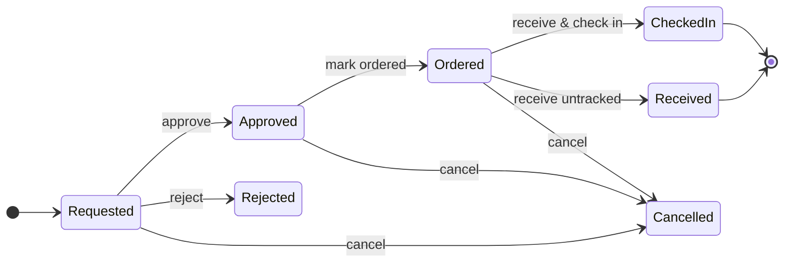

# Procurement requests

Procurement turns "we need this" into an inventory item with an unbroken paper
trail. Each **request** covers one article and flows through a fixed workflow;
every step is permission-checked and audit-logged, and the people involved are
[notified by email](notifications.md).

## The workflow at a glance

| Step | Who may do it (permission) |
|---|---|
| Raise a request | `create_request` |
| Approve / reject | `approve_request` (or the requester with `self_approve`) |
| Mark ordered | `place_order` |
| Receive / check in | `check_in` |
| Cancel | the requester themselves, or a lab manager (`manage_lab`) |

The request detail page always shows exactly the action buttons *you* may use in
the current status — if a button is missing, either the status doesn't allow the
move or you lack the permission.

## Raising a request

**Requests → New request** (requires `create_request`). You describe the article —
name, catalog number, CAS number, product URL, vendor — and the commercial side.
**Item name, vendor, budget and price are required** (for the vendor, typing a new
name creates it when the request saves). A price of 0 is accepted — e.g. for free
samples — but the form asks you to confirm it:

- **Unit price × pack count + shipping cost**, in one of the offered currencies
  (the lab default is preselected).
- **VAT is calculated automatically** from the lab's VAT rate. If your quoted price
  already includes taxes, tick *includes taxes* and the total is taken as-is (the
  VAT portion is back-calculated for information). Totals are rough estimates for
  budget tracking, never accounting-grade figures.
- **Budget (Kostenstelle)** and **shipping address** — the lab's defaults are
  preselected; the budget is what the cost is later reported against.
- Optional extras: mark it **urgent**, pick who the order is
  [handed over to after approval](#choosing-the-coordinator-already-when-raising-the-request),
  a quote ID, expected delivery date, tags, and a free-text comment.

!!! warning "What “urgent” actually does"
    Urgent requests are highlighted in the request list, and the notification
    emails to approvers and purchase coordinators go out **high-priority** —
    flagged in the subject line, in the message body, and via mail headers, so
    they stand out in the recipient's inbox. That makes it a loud signal:
    reserve it for orders where a delay genuinely hurts. Flagging routine
    orders as urgent trains everyone to ignore the flag and needlessly alarms
    the people who process your requests.

You can also record **GHS hazard data** (hazard statements, signal word, storage
class) already at request time — the recommended moment: it is carried onto the
inventory item at check-in, so safety information is in the system *before* the
container arrives and stays with the record from then on. The CAS-based GHS lookup
is a **best-effort suggestion from PubChem — always verify it against the vendor's
SDS or product page**.

Attach files (quotes, offers) to the request, and use the comment thread for
discussion. A request can be **edited only while it is still *Requested***; after
approval it is fixed and can only move through the workflow.

## Approval

Anyone with `approve_request` sees pending requests (dashboard widget and request
list filter) and can **Approve** or **Reject** them. The approver is recorded on
the request.

### Self-approval

Labs where members get verbal approval ("just order it") can grant the
`self_approve` permission: the requester may then approve **their own** pending
request. A self-approval behaves like a normal approval but additionally posts a
visible comment on the request ("Self-approved — authorised by lab management in
person", plus your optional note), so it always stays on the record. Users who can
approve anything anyway just use the normal Approve button.

## Forwarding to a purchase coordinator

In many labs a dedicated person (or office) places the actual orders. An approved
request can be **forwarded**, and the list of people it can go to is exactly the
lab's members **holding the `accept_forwards` permission** — whether through the
*Purchase coordinator* role or any other role that grants it. (Being *able to
order* is separate: someone with `place_order` but not `accept_forwards` can place
orders themselves yet never appears in the forward list.) The chosen assignee gets
an email and sees the request in their **Requests to order** dashboard widget. The
requester, approvers, people who may order, and lab managers may forward.

### Choosing the coordinator already when raising the request

The request form offers **Hand over to (after approval)** with the same list of
people. Pick someone there and the hand-over happens **automatically the moment
the request is approved**: the coordinator gets the usual "please order" email,
and you are told in your approval email that the request went to them as you
requested. Until approval, nothing is assigned — **you remain responsible for
the request**, including discussing it with your lab manager; only after
approval does the purchase coordinator take over.

## Ordering

Whoever places the order (permission `place_order`) presses **Mark ordered**,
optionally recording the **PO number**. All approved requests are visible to
everyone with `place_order`, assigned or not.

## Receiving a delivery

When the goods arrive, anyone with `check_in` opens the request and **receives**
it. This is a dialog, not a one-click action, because you choose one of two
outcomes — both terminal:

- **Check in to inventory** — creates the inventory item from the request (name,
  vendor, price, catalog/CAS number, tags, hazard data; the requester becomes the
  owner), at the storage location you pick, with the next free frozen ID or one
  you choose. The request moves to **Checked in** and links to the item — and the
  item links back to its request forever. Optionally, the request's attachments
  can be copied onto the item (useful for an SDS or manual; POs and invoices
  usually stay on the request).
- **Receive without tracking** — for software, services, or anything the lab does
  not keep in inventory. The request simply moves to **Received**.

## Cancelling

The requester can cancel their own request at any point before it is received; a
lab manager can cancel anyone's. Cancelled and rejected requests stay visible in
the list for the record.

## Finding requests

The request list (requires `view_requests`) is filterable — by status, and by
"mine": requests you raised or deliveries you are waiting for. The dashboard
surfaces the same things proactively, newest first.
